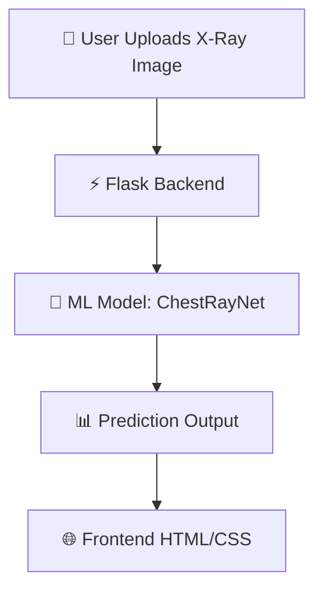

# 🩺 InsightX — X-ray Screening AI (Flask + ML)

<p align="center">
  
  
  
  
  
</p>

---

## 📚 Table of Contents
- [Team Members](#team-members)
- [Overview](#overview)
- [Tech Stack](#tech-stack)
- [Project Structure](#project-structure)
- [Documentation](#documentation)
- [Usage](#usage)
- [Features](#features)
- [Screenshots](#screenshots)
- [Developer Notes](#developer-notes)
- [Contributing](#contributing)
- [License](#license)
- [Credits](#credits)

---
 ## Team Members 👥

  > **Note:** Names are listed in **alphabetical order** (except team lead) and **do not reflect the level of contributions**. 

| Member | Role | GitHub |
|--------|------|--------|
| Rishav Mishra | Team Lead, ML Modelling| [@tokito-99](https://github.com/tokito-99) |
| Aayusha Pokharel | Front-end| [@ap4678](https://github.com/ap4678) |
| Bivan Prajapati | Front-end | [@bivanPrajapati](https://github.com/BivanPrajapati) |
| Menuka Ghalan | Back-end|[@menukaghalan](https://github.com/menukaghalan) |
| Seema Gupta | Back-end|[@gupta-seema](https://github.com/gupta-seema) |

> **Collaboration Note:** Although roles were initially divided as above, the project was highly collaborative. Each of us contributed beyond our initial responsibilities across all areas--from ideation, coding, debugging, documentation to presentation.

---

## Overview
**InsightX** is a Flask-powered web app for **rapid X-ray screening**.  
Upload an image (JPG/PNG/PDF/DICOM), get **predictions** and **explainability** overlays (Grad-CAM), and view a structured **screening card**.

---

## Tech Stack
- **Backend:** Flask (Python)
- **Frontend:** HTML + CSS (responsive)
- **ML (planned):** ...
- **Storage:** Local `web_uploads/` for previews
- **Deploy:** Localhost now; cloud-ready later



---

## Project Structure
```
FrontEnd_Flask/
├─ app.py                    # Flask entrypoint
├─ static/
│  └─ style.css              # App styling
├─ templates/
│  └─ index.html             # Main UI template
├─ web_uploads/              # Generated previews (auto-created)
├─ requirements.txt          # Python dependencies
├─ model_chestray.py         # (optional) ML model module
├─ chestray_labels.py        # (optional) label map
└─ report_builder.py         # (optional) screening card builder
```

---

## Documentation

---

## Usage
1. Click **Choose File** and select a chest X-ray (JPG/PNG/PDF/DICOM).
2. Click **Analyze**.
3. View **suspected finding**, **risk tier**, **decision**, **top findings**, the **uploaded image**, **Grad-CAM heatmap**, and the **raw JSON** card.

---

## Features
- 🖼️ **Multi-format uploads:** JPG, PNG, PDF (single/multi-page), DICOM
- ⚡ **Fast UX:** clean, responsive interface
- 🔍 **Explainability:** Grad-CAM overlay (with model)
- 🧾 **Structured output:** decision, risk tier, top findings, JSON card
- 🌐 **Local-first:** simple to run 

---

**Planned model logic**
- ...
- ...
- ...

---

## Screenshots
> Replace with real screenshots later.

```
[ Upload Panel ] -------------------------
|  [ Choose file ]  [ Analyze ]          |
|  Supported: JPG, PNG, PDF, DICOM       |
------------------------------------------
```

```
[ Results Card ] -------------------------
|  Suspected: Pneumonia (0.82)           |
|  Decision: Refer within 48h            |
|  Risk Tier: High                       |
|  Top Findings: Infiltrate, Opacity     |
|  [Uploaded]   [Grad-CAM Heatmap]       |
------------------------------------------
```

---

## Developer Notes

### Requirements
Typical `requirements.txt` contents (adjust as needed):
```
flask>=2.3
Pillow
numpy
torch
torchvision
pytorch-grad-cam
```

### Environment Variables
- `MODEL_WEIGHTS` — path to `.pt` file
- `THRESHOLDS` — path to thresholds JSON (optional)
- `IMG_SIZE` — input size (default 320)
- `UPLOAD_DIR` — where previews are written (default `web_uploads`)
- `USE_MOCK` — set to `1` to run without real model (if implemented)

### Tips
- If `pip`/`python` aren’t recognized on Windows, add the **Python install directory** to your `PATH` and re-open the terminal.
- If PDFs/DICOMs aren’t previewing: server extracts a representative image for display; ensure server logs show conversion succeeded.
- If Grad-CAM fails, verify `model.gradcam_target_layer()` exists and returns a valid layer.

---

## Contributing
1. Fork the repo
2. Create a feature branch
```
git checkout -b feat/bilingual-ui
```
3. Commit & push
```
git commit -m "feat: add Nepali i18n"
git push origin feat/bilingual-ui
```
4. Open a Pull Request 🎉

---

## License
This project is released under the **MIT License**. See `LICENSE`.

---

## Credits
- UI/UX: HTML + CSS, inspired by modern healthcare dashboards
- Backend: Flask
- ML: (planned) ChestRayNet + Grad-CAM
- Team 8848 — Nepal–US AI Hackathon
---
   
